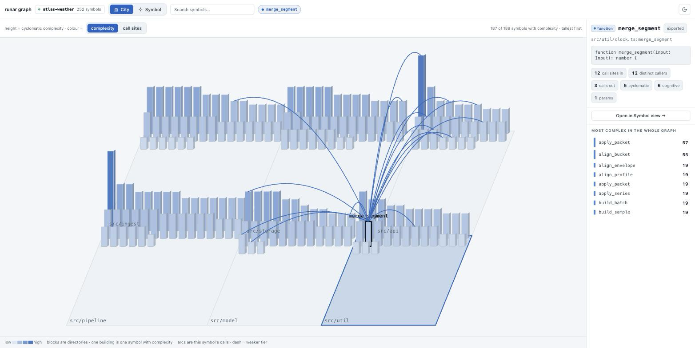
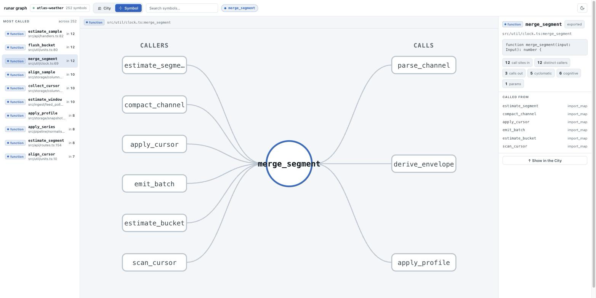
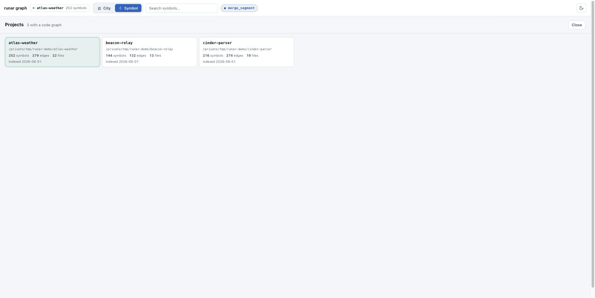

# RunarForge — Huginn & Muninn

[](https://github.com/crlome/runar-forge/releases/latest)
[](https://www.npmjs.com/package/@runar-forge/cli)
[](https://github.com/crlome/runar-forge/actions/workflows/ci.yml)
[](LICENSE)


<!-- release/npm/CI/license are live. tests/languages/platforms are static
     strings and will drift; re-check them at release time — `tests` against
     the preflight `cargo test -p runar-muninn --lib` count, `languages`
     against the tree-sitter grammars in crates/muninn/Cargo.toml. -->

> Persistent, semantically-searchable memory for AI coding tools.
> One static Rust binary. SQLite or PostgreSQL. MCP-compatible.

**`runar`** is a single-binary CLI that gives Claude Code, VS Code,
OpenCode, Codex, Cursor, Windsurf, Trae, Gemini CLI, Continue.dev, Zed,
Goose, Kimi — any MCP-aware AI tool — a memory that survives session
closes, travels across tools, and understands codebase structure.

Named after Odin's two ravens from Norse mythology:

- **Huginn** ("thought") — the **scout**: crawls codebases, builds
  dependency graphs, scores file importance, extracts patterns and
  tech debt.
- **Muninn** ("memory") — the **librarian**: stores, retrieves,
  ranks, and graduates entries through tiered memory layers
  (working → episodic → semantic → archival).

A third subsystem, the **Curator**, answers natural-language
questions by assembling context from memory.

---

## Features

- **One static binary.** No Node, no Python, no runtime deps.
  ~16 MB on macOS arm64; ~70 MB with bundled local embeddings.
- **Two storage backends.**
  - SQLite (bundled via `rusqlite` `bundled-full` + FTS5) — zero
    setup, single-machine, default for solo use.
  - PostgreSQL 16+ with `pgvector` — multi-user, full semantic
    search, shared team memory.
- **Hybrid local + remote sync.** Outbox + reconcile pattern with
  LWW + verified tiebreaker. Run sqlite or local-pg as a fast
  primary and a remote PG as the team store; `runar sync push|pull`
  drains the outbox and pulls deltas.
- **MCP server.** `runar mcp-muninn` speaks the Model Context
  Protocol over stdio. 28 tools exposed
  under `muninn_*` (13), `huginn_*` (10), `curator_*` (5).
- **Symbol-level code graph.** `runar crawl` extracts definitions, call
  sites and per-function complexity into a dedicated `codegraph.db`
  (Rust, TypeScript/JS, Python, Go), then resolves calls into edges
  through a confidence-ranked tier chain. Query it with
  `runar graph search|symbol|trace|status` or the `huginn_search_graph`
  / `huginn_symbol` / `huginn_trace` MCP tools. An edge is evidence or
  it is absent: unmatched calls are counted, never attached to a
  plausible-looking definition.
- **A code view for humans.** `runar graph serve` opens a browser on
  localhost; `runar graph export` writes the same interface to a single
  HTML file that works offline. No bundler, no CDN, no vendored
  JavaScript, and no new dependency — see [Code view](#code-view).
- **Tiered memory.** Entries graduate through 4 layers based on age,
  citation count, verification, and confidence; `runar gc` enforces
  retention.
- **Auto-capture.** Optional Claude Code hooks queue PostToolUse
  payloads, then summarize them at session end (Claude Haiku if
  `ANTHROPIC_API_KEY` is set, otherwise heuristic fallback).
- **Health checks.** `runar doctor` runs 10 read-only probes
  (env file, storage, DB reachable, auth, pgvector, schema,
  migrations, row counts, breaker state, project-local `.env`).
- **Self-update.** `runar update --check|--rollback` fetches signed
  release manifests; previous binary preserved at `runar.previous`.

---

## Install

### A. Build from source

```bash
git clone https://github.com/crlome/runar-forge.git
cd runar-forge
cargo build --release -p runar-muninn
# Binary lands at target/release/runar
sudo mv target/release/runar /usr/local/bin/runar
```

With bundled local embeddings (no external embedding API required):

```bash
cargo build --release -p runar-muninn --features local-embeddings
```

### B. Pre-built binary

Pick the matching tarball from
[GitHub Releases](https://github.com/crlome/runar-forge/releases):

| Target                          | Asset                                          |
|---------------------------------|------------------------------------------------|
| Linux x86_64                    | `runar-x86_64-unknown-linux-gnu.tar.gz`        |
| Linux aarch64                   | `runar-aarch64-unknown-linux-gnu.tar.gz`       |
| macOS arm64 (Apple Silicon)     | `runar-aarch64-apple-darwin.tar.gz`            |
| macOS x86_64 (Intel)            | `runar-x86_64-apple-darwin.tar.gz`             |
| Windows x86_64                  | `runar-x86_64-pc-windows-msvc.zip`             |

Each tarball/zip is paired with a `.sha256` checksum.

### C. npm

```bash
npm install -g @runar-forge/cli
```

`@runar-forge/cli` is a tiny launcher; npm pulls the binary as the matching
per-platform optional dependency (`@runar-forge/cli-<os>-<cpu>`). **No install
scripts, no install-time network** — so it installs cleanly even with
`ignore-scripts=true`.

---

## Quick start

```bash
runar init                          # creates ~/.runar-forge/.env
runar config wizard                 # interactive storage + DB setup
runar doctor                        # 10 read-only health checks
runar setup claude-code -p my-proj  # wire MCP tools into Claude Code
```

Optional auto-capture (PostToolUse queue + SessionEnd summarizer):

```bash
runar setup claude-code -p my-proj --with-auto-capture
```

Other editors — same `mcp-muninn` server, different config file. `vscode`,
`opencode`, and `codex` auto-write their config; `cursor` and `windsurf` print
it for manual paste. Hooks (context injection, auto-capture) are Claude Code
only — the rest are MCP tools only.

```bash
runar setup vscode      # writes .vscode/mcp.json   (servers.muninn)
runar setup opencode    # writes opencode.json      (mcp.muninn, type=local)
runar setup codex       # writes ~/.codex/config.toml ([mcp_servers.muninn])
runar setup cursor      # prints MCP config for manual paste
runar setup windsurf    # prints MCP config for manual paste
```

---

## Code view

Every other surface on the graph targets an agent. This one targets you.

```bash
runar graph serve                 # opens a browser on 127.0.0.1
runar graph export -p myproject   # one self-contained HTML file
```

Two altitudes of one tool, with a toggle between them. Selecting a symbol never
changes altitude — clicking a tower shows you its card where it stands.

### City

Directories are blocks, symbols are buildings, height is cyclomatic complexity,
so the thing most likely to hurt you is the tallest thing on screen. Selecting
one arcs its calls across the city; the dash pattern is the resolver's own
confidence tier, so a weak guess looks like one.



Only symbols that *have* complexity get a building — on a large codebase most
symbols are fields and type declarations, and drawing them buries the towers
that matter. The header always states what was drawn against what exists.

### Symbol

Search on the left, the neighbourhood in the middle, the definition on the
right. Never the whole graph: one symbol's callers and callees, and a click
moves you to any of them.



Note the card shows **call sites** and **distinct callers** separately. They are
different questions, and on real code they differ by a factor of three or more —
a function called ten times from one test is not a hub.

### Projects

One `codegraph.db` holds every project you have crawled. Served, the switcher
reads it live.



> Screenshots are taken against generated fixtures, not real code —
> see `tools/fixtures/demo_graph.py`.

**On `serve` and safety.** It binds `127.0.0.1` only, puts a 128-bit random
token in the URL path so a page you visit cannot reach it by guessing the port,
validates the `Host` header against DNS rebinding, answers `GET` only, and
opens the store read-only. No CORS headers are sent.

---

## CLI reference

| Command                      | Purpose                                                                         |
|------------------------------|---------------------------------------------------------------------------------|
| `runar mcp-muninn`           | Start MCP server over stdio (called by AI tools, not humans).                  |
| `runar init`                 | Create `~/.runar-forge/.env`. `--interactive` runs the wizard.                 |
| `runar config <action>`      | Manage `~/.runar-forge/.env`: `path`, `show`, `get`, `set`, `unset`, `wizard`. |
| `runar doctor`               | 10 read-only health checks. `--db`, `--json`, `--quiet`, `--timeout-ms`.       |
| `runar setup <tool>`         | Wire MCP into `claude-code`/`vscode`/`opencode`/`codex`/`cursor`/`windsurf`. `--with-auto-capture`, `--configure`. |
| `runar update`               | Self-update binary via release manifest. `--check`, `--channel`, `--rollback`. |
| `runar search <query>`       | CLI-side semantic search; `--limit`.                                           |
| `runar save <title> <body>`  | Save a memory entry from the shell. `--project`, `--type`, `--tags`, `--topic-key`. |
| `runar stats`                | Memory system statistics (entries by type, sessions, layers).                  |
| `runar crawl [<path>]`       | Crawl a project. `--project`, `--mode auto|full|incremental`. Builds the symbol graph by default; `--no-deep` skips it. |
| `runar graph search <query>` | Full-text search over symbol names. `--project`, `--label`, `--limit`.         |
| `runar graph symbol <name>`  | Definition site, signature, metrics and one-hop callers/callees. `--project`.  |
| `runar graph trace <name>`   | Walk the call graph. `--direction callers|callees`, `--depth` (max 5), `--limit`. |
| `runar graph status`         | Symbol-graph coverage: files indexed, skipped by language, symbols, edges, unresolved calls. |
| `runar graph serve`          | Open the code view on localhost. `--project`, `--port` (0 = pick one), `--no-open`. |
| `runar graph export`         | Write the code view to one self-contained HTML file. `--project`, `--output`.  |
| `runar hint`                 | PreToolUse `Grep|Glob` search hints from the symbol graph. `--silent` for hook use; opt in via `setup claude-code --with-search-hints`. |
| `runar architecture`         | Latest architecture summary for a project.                                     |
| `runar techdebt`             | List TODO/FIXME/HACK/XXX markers. `--type`.                                    |
| `runar ask <question>`       | Curator Q&A from the CLI. `--project`.                                         |
| `runar onboard`              | Multi-section onboarding report. `--json`.                                     |
| `runar benchmark`            | Memory-quality benchmark (deterministic). `--mode quick|full`.                 |
| `runar gc`                   | Tier graduation + stale eviction. `--project`, `--dry-run`.                    |
| `runar export`               | Export entries as JSONL. `--project`, `--type`, `--output`, `--limit`.         |
| `runar import <file>`        | Import entries from JSONL.                                                     |
| `runar sync init`            | Validate local + remote pair. `--force` overrides schema mismatch.             |
| `runar sync push`            | Drain local outbox to remote. `--limit`, `--dry-run`.                          |
| `runar sync pull`            | Incremental pull (remote → local). `--limit`, `--dry-run`, `--since`.          |
| `runar sync bootstrap`       | First-time / full-table pull. `--project`, `--page-size`, `--yes-i-know`.      |
| `runar sync status`          | Read-only sync health summary. `--json`.                                       |
| `runar sync enable\|disable` | Toggle background auto-sync.                                                   |
| `runar sync gc`              | Outbox retention sweep (default 7 days). `--dry-run`.                          |
| `runar session ping\|list`   | Session heartbeat / recent-session listing.                                    |
| `runar context`              | Print recent context (PreToolUse hook target).                                 |
| `runar nudge`                | UserPromptSubmit hook (idle-save reminder).                                    |
| `runar save-ack`             | PostToolUse acknowledgement hook.                                              |
| `runar extract`              | Passive PostToolUse extraction (gated by `RUNAR_PASSIVE_LEARNING=true`).       |
| `runar enqueue`              | Enqueue raw PostToolUse payload onto observation queue.                        |
| `runar summarize`            | SessionEnd: claim observations, summarize, write entries.                      |

Run `runar --help` or `runar <subcommand> --help` for the full flag list.

---

## MCP tool catalogue

Exposed by `runar mcp-muninn`. Tool names are snake_case, prefixed
with the package they belong to.

### Muninn (memory)

| Tool                       | Description                                                                 |
|----------------------------|-----------------------------------------------------------------------------|
| `muninn_save`              | Save a memory entry after significant work (bug fix, decision, pattern).   |
| `muninn_search`            | Fused search (semantic + keyword + decay + recency); compact rows by default. |
| `muninn_get`               | Fetch full content of an entry by ID.                                       |
| `muninn_context`           | Recent context from previous sessions; call after compaction.               |
| `muninn_timeline`          | Entries created around the same time as a given entry.                      |
| `muninn_related`           | Edges (relationships) for an entry.                                         |
| `muninn_session_start`     | Register the start of a work session.                                       |
| `muninn_session_end`       | Save structured end-of-session summary.                                     |
| `muninn_stats`             | Memory system statistics.                                                   |
| `muninn_verify`            | Owner-endorse an entry; ranks above un-verified peers.                      |
| `muninn_capture_passive`   | Parse a `## Key Learnings` block and fan out to multiple entries.           |
| `muninn_merge_projects`    | Merge entries + sessions across project namespaces. `dryRun` first.         |
| `muninn_debug`             | Internal operation traces (requires `RUNAR_DEBUG=true`).                    |

### Huginn (scout)

| Tool                  | Description                                                          |
|-----------------------|----------------------------------------------------------------------|
| `huginn_crawl`        | Scan files, build graph, score importance, save analysis to memory. |
| `huginn_status`       | Crawl status + entry breakdown for a project.                       |
| `huginn_architecture` | Latest architecture summary.                                        |
| `huginn_techdebt`     | TODO/FIXME/HACK/XXX entries from the crawler.                       |
| `huginn_recrawl_file` | Re-analyze a single file after editing (memory entry + symbol graph). |
| `huginn_search_graph` | Full-text search over symbol names, ranked, with an optional label filter. |
| `huginn_symbol`       | One symbol: definition site, signature, metrics, one-hop callers and callees. |
| `huginn_trace`        | Walk callers or callees from a symbol, or find a path between two.  |
| `huginn_benchmark`    | Memory-quality benchmark (deterministic scoring).                   |
| `huginn_skills`       | Static skills/best-practices reference.                             |

### Curator (Q&A)

| Tool                | Description                                                  |
|---------------------|--------------------------------------------------------------|
| `curator_ask`       | Ask a question; assembles memory context and synthesizes.    |
| `curator_topics`    | Discover knowledge topics, grouped by type.                  |
| `curator_decisions` | List architectural and technical decisions.                  |
| `curator_techdebt`  | List known tech-debt items.                                  |
| `curator_onboard`   | Multi-section onboarding report.                             |

---

## Configuration

Config lives at `~/.runar-forge/.env`. Edit via `runar config set <KEY> <VAL>`.

### Storage selection

| Var                       | Default                  | Effect                                                         |
|---------------------------|--------------------------|----------------------------------------------------------------|
| `RUNAR_STORAGE`           | `postgresql`             | `postgresql` or `sqlite`.                                      |
| `RUNAR_DB_URL`            | —                        | PostgreSQL connection string (used when `STORAGE=postgresql`). |
| `RUNAR_DB_POOL_MAX`       | `10`                     | Connection pool ceiling.                                       |
| `RUNAR_DB_CONNECT_TIMEOUT_MS` | `8000`               | Connect/acquire budget. Tighten in CI, loosen on slow networks. |
| `RUNAR_SQLITE_PATH`       | `~/.runar-forge/memory.db` | SQLite file location (used when `STORAGE=sqlite`).           |
| `RUNAR_MEMORY_NAMESPACE`  | `default`                | Logical isolation per team / project / env.                    |

### Embeddings

| Var                       | Default      | Effect                                                              |
|---------------------------|--------------|---------------------------------------------------------------------|
| `RUNAR_EMBEDDINGS`        | `disabled`   | `disabled` (keyword only), `local` (fastembed/ONNX, requires `local-embeddings` feature), or `openai`. |
| `RUNAR_VECTOR_DIMENSIONS` | `384`        | Must match the model — 384 (MiniLM) or 1536 (OpenAI small).         |
| `OPENAI_API_KEY`          | —            | Required when `RUNAR_EMBEDDINGS=openai`.                            |
| `RUNAR_EMBEDDING_MODEL`   | `text-embedding-3-small` | Override OpenAI model.                                |
| `RUNAR_MODELS_DIR`        | platform-default | Override fastembed model cache path.                            |

### Hybrid sync (Phase 5.6)

| Var                              | Default | Effect                                                                |
|----------------------------------|---------|-----------------------------------------------------------------------|
| `RUNAR_STORAGE_LOCAL`            | unset   | Opt-in: enables outbox + sync (`sqlite` or `postgresql`).             |
| `RUNAR_STORAGE_REMOTE`           | unset   | Remote backend selector (defaults to `postgresql`).                   |
| `RUNAR_SYNC_AUTO`                | `false` | Toggle background auto-sync loop in `mcp-muninn`.                     |
| `RUNAR_SYNC_INTERVAL_MS`         | `30000` | Idle backoff floor for the auto-sync loop.                            |
| `RUNAR_SYNC_MAX_BACKOFF_MS`      | `300000`| Idle backoff ceiling.                                                 |
| `RUNAR_SYNC_OUTBOX_RETENTION_DAYS` | `7`   | Confirmed-row retention before `sync gc` deletes them.                |

### Tiered memory (Phase 5.4)

| Var                                | Default  | Effect                                                       |
|------------------------------------|----------|--------------------------------------------------------------|
| `RUNAR_TIER_WORKING_DAYS`          | `1`      | Working-layer max age before graduation.                     |
| `RUNAR_TIER_EPISODIC_DAYS`         | `7`      | Episodic-layer max age.                                      |
| `RUNAR_TIER_SEMANTIC_DAYS`         | `30`     | Semantic-layer max age.                                      |
| `RUNAR_TIER_CITATION_THRESHOLD`    | `5`      | Access-count Hebbian promotion bump.                         |
| `RUNAR_TIER_LOW_CONFIDENCE`        | `0.5`    | Confidence floor for aggressive demotion.                    |
| `RUNAR_TIER_EVICTION_AGE_DAYS`     | `90`     | Stale-archival eviction age.                                 |
| `RUNAR_TIER_EVICTION_MAX_PER_RUN`  | `1000`   | Per-`gc`-run eviction cap.                                   |

### Hooks / runtime

| Var                          | Default | Effect                                                                    |
|------------------------------|---------|---------------------------------------------------------------------------|
| `RUNAR_HOOK_BUDGET_MS`       | `5000`  | Outer budget for any single hook fire.                                    |
| `RUNAR_DISABLE_HOOKS`        | unset   | Set to `1` to bypass all Claude Code hooks (escape hatch).                |
| `RUNAR_PASSIVE_LEARNING`     | unset   | Set to `true` to enable `runar extract` rule-based capture.               |
| `RUNAR_SAVE_PROMPTS`         | unset   | Persist captured prompts (otherwise scrubbed).                            |
| `RUNAR_DEBUG`                | unset   | Enable internal debug log (`muninn_debug` MCP tool).                      |
| `RUNAR_API_KEY`              | unset   | Reserved; not read by any current code path.                              |
| `RUNAR_UPDATE_MANIFEST_URL`  | unset   | Override the release manifest URL for `runar update`.                     |

`docs/HOW_TO_USE_IT.md` covers each subsystem in depth.

---

## Storage backends — when to pick which

- **SQLite** (`RUNAR_STORAGE=sqlite`) — single user, single machine,
  zero external services. FTS5 keyword search. Use for solo
  developers, CI fixtures, or as the *local* side of hybrid sync.
- **PostgreSQL + pgvector** (`RUNAR_STORAGE=postgresql`) — multi-user,
  full semantic search, ACID-safe shared memory. Use for teams and
  as the *remote* side of hybrid sync.

The repo ships an optional `docker-compose.yml` profile to run the
backing PG without installing it locally:

```bash
docker compose --profile postgresql up postgres
```

---

## Hybrid local + remote sync

Run `runar` against a fast local primary (sqlite or local PG) and
periodically reconcile with a remote PG that the rest of the team
shares. The conflict resolver uses LWW with a verified-row tiebreaker;
`runar sync init` validates the pair, `bootstrap` does first-time
pulls, `push`/`pull` are idempotent.

See [`docs/HOW_TO_USE_IT.md`](docs/HOW_TO_USE_IT.md) §sync for the
full operator playbook.

---

## Repository layout

| Path                       | Purpose                                                          |
|----------------------------|------------------------------------------------------------------|
| `Cargo.toml`               | Workspace manifest + release profile.                            |
| `crates/muninn/`           | The single Rust crate that produces the `runar` binary.          |
| `packages/cli-wrapper/`    | `@runar-forge/cli` npm launcher (binary ships via per-platform optional deps; no install scripts). |
| `docs/`                    | User guides — installation, upgrade hygiene, usage walkthrough.  |
| `tools/scripts/`           | Helper SQL (`init-postgres.sql` for the docker-compose service). |
| `docker-compose.yml`       | Optional Postgres + pgvector backing service.                    |
| `.github/workflows/`       | CI (`ci.yml`) + release pipeline (`release.yml`).                |
| `.env.example`             | Documented env-var reference for `~/.runar-forge/.env`.          |

---

## Development

```bash
cargo build --release -p runar-muninn
cargo test --release --workspace
cargo clippy --workspace --all-targets -- -D warnings
cargo fmt --all -- --check
```

The release profile uses `lto = "thin"`, `codegen-units = 1`, `strip = true`
to keep the shipped binary lean (~16 MB without local embeddings,
~70 MB with).

CI runs the same gates on Linux, macOS, and Windows for every push
and PR (`.github/workflows/ci.yml`). Tagging `v<x.y.z>` triggers
`release.yml`, which builds five targets and uploads
tarballs/zip + sha256 checksums to the GitHub Release.

---

## License

MIT © RunarForge. See [`LICENSE`](LICENSE).

---

> *"Huginn and Muninn fly each day over the spacious earth.*
> *I fear for Huginn, that he come not back,*
> *yet more am I anxious for Muninn."*
> — Grímnismál, Stanza 20
